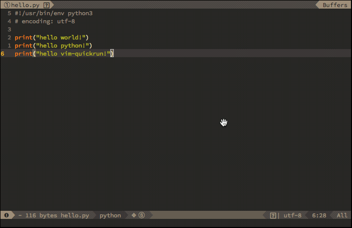

Vim 插件之 vim-quickrun
===

* **作用**: 快速执行当前文件, 例如 go、python 和 shell 等, 主要用于快速验证一些代码实现。
*** Github 地址**为: [vim-quickrun]

## 1. 安装和配置

使用 [vim-plug] 安装，在 `.vimrc` 中添加如下配置：

```
Plug 'thinca/vim-quickrun'

let g:quickrun_config = {
\   "_" : {
\       "outputter" : "message",
\   },
\}

let g:quickrun_no_default_key_mappings = 1
nmap <leader>r <Plug>(quickrun)
map <F10> :QuickRun<CR>
```

## 2. 演示

配置使用 `message` 进行结果展示, 即展示运行结果后, 按任意键回到 `Vim` 编辑模式。同时, 映射 `<leader>r` 或者 `<F10>` 快捷键，或者直接使用 `:QuickRun`。



[vim-quickrun]: https://github.com/thinca/vim-quickrun
[vim-plug]: https://github.com/junegunn/vim-plug
